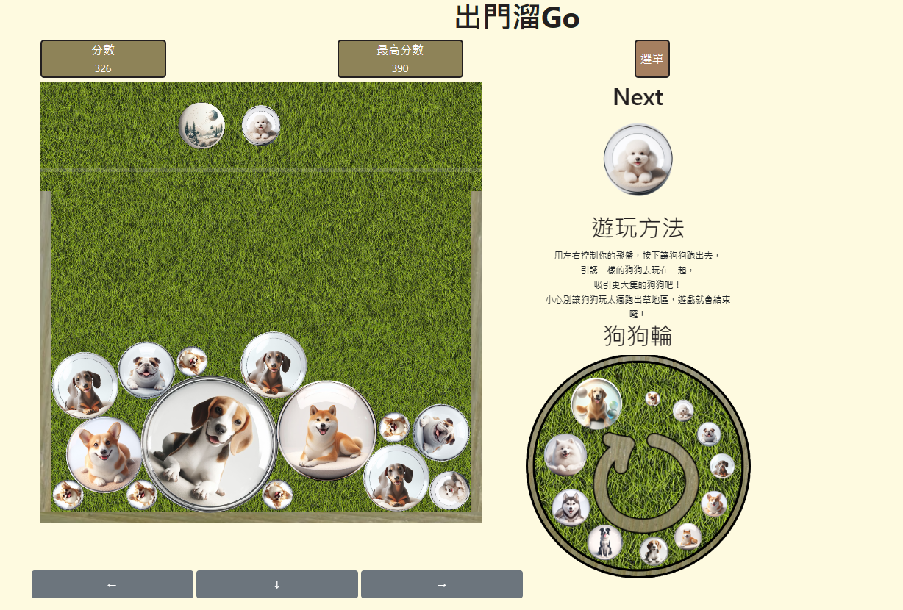

# WanWanGame

</img>

## 介紹

用之前寫過的[遊戲](https://github.com/AhChao/MatterJSPractice/tree/main/Day/Day29)稍作修改後變為和 Nintendo Switch 上的西瓜遊戲一樣模式。
操作左右下方向鍵來控制球體墜落、堆疊一樣的球體來得到分數。
如果球體堆疊超出虛線、飛出虛線一定時間則遊戲結束，盡可能的得到高分。
主要以 javascript 撰寫，物理引擎搭配 [Matter.js](https://github.com/liabru/matter-js) 的 Libaray，RWD 上用到 [Bootstrap 5](https://getbootstrap.com/docs/5.0/utilities/display/) 的 grid system 來協助排版。
[線上遊玩頁面](https://ahchao.github.io/WanWanGame/)

## 高可客製化

為了讓這個遊戲能夠被簡單地套上不同的模組，我將大部分的設定都抽到 src/setting.js 的檔案裡，裡面有多數可客製化的參數。
個人建議 Game reltaed parameter 以下的區塊不要做調整，其餘區塊的說明都明寫了。
遊戲內的圖片都是吃固定位置的圖片，只要你把圖片替換掉、根據你的圖片大小調整設定值，即可用你喜歡的圖片以及我的程式碼，快速地做出西瓜遊戲。

### 詳細的 How - To 改變遊戲圖案

1. 準備好 11 張圓形圖，命名為 1 ~ 11.png，放入 img/balls/ 資料夾中取代舊有檔案
2. 準備好背景圖、外框圖、變形示意輪、爪子圖，放到 background/ 資料夾中，依序取代 background.png, boundary.png, circle.png, claw.png(外框圖請準備單一側邊即可，會以該側邊生出另一個側邊與底部)
3. 實際玩遊戲確認圖的大小調整，調整 src/setting.js 這行中的 setting_textureScale，除了第一個值不調整，後面依序為 1 - 11 的貼圖大小。 遊戲內球體的大小是固定的，比例在 setting_textureScale 的上一行有寫，調整成與你的圖相符的比例，確保碰撞視覺效果與你的圖一致。
4. 依據你的爪子圖希望放的位置與大小調整 setting_clawRelativePosition 和 setting_textureScaleClaw 這兩個參數，前者調整爪子相對於球的正中心的位置，如我的飛盤是放在球的左邊，另一個是爪子大小，爪子並不會碰撞，大小只影響顯示
5. 其他還有一些設定細項可以調，但就要自己讀一下 setting 中的其他英文，如果覺得希望有更多可調整參數或有效果不如預期，可以發 issue 給我

---

## Introduce in English

Copied the base from my [previous project](https://github.com/AhChao/MatterJSPractice/tree/main/Day/Day29) and rewrite it to a suika-game-like game.
The suika game is a 2048-like game published on Nintendo Switch, this project just a project try to simulate it.

This project is written by javascript, use the lib [Matter.js](https://github.com/liabru/matter-js) to deal psysical stuff, and grid system in [Bootstrap 5](https://getbootstrap.com/docs/5.0/utilities/display/) to layout on different size screen.

[Play it now online](https://ahchao.github.io/WanWanGame/)
